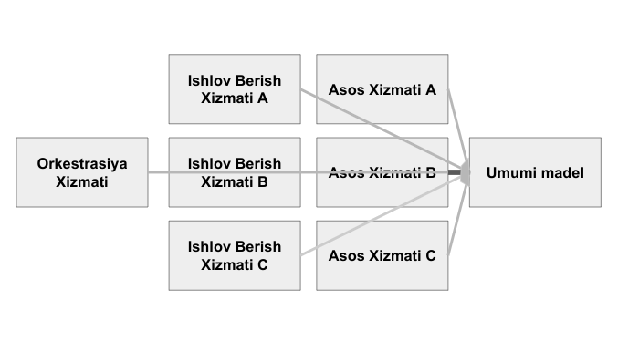

# 0.2 Tamoyillari
Ushbu qismda biz "Me'yor" tamoyillarini o'rganamiz. Ushbu tamoyillar me'yorga mos keladigan tizimning barcha komponentlariga taalluqlidir, Xoh ushbu komponentlar brokerlar, xizmatlar yoki taqdim etuvchilar bo'lsin.

## 0.2.0 Inson Ustuvorligi
Ushbu tamoyilning asosiy g'oyasi odamlarni hisobga olgan holda me'yorga mos keladigan tizimlarni qurish va loyihalashdir. Nafaqat tizimdan foydalanmoqchi bo'lganlar, balki uni saqlab qoladigan va rivojlantiradigan odamlarni ham hisobga olgan holda me'yorga mos keladigan tizimlarni qurish va loyihalashdir.

Tizim "Inson Ustuvorligi" tamoyiliga amal qilishi uchun u murakkablikdan ko'ra oddiylikni hurmat qilishi kerak. Oddiylik qayta yozish imkoniyatini beradi. Bu monolit (yakka-asosli) sistemalarni umumiy andazasida haqiqiy bo'laklana olish xususiyati berish uchun xayolan mayda parchalarga bo'lib loyihalashni taqazo qiladi.

Shuningdek, "Me'yor" murakkab muhandislik tushunchalari ko'pchilik dasturchilar tomonidan hazm qila olinishilikni ta'minlaydi. Sanoatdagi yangi muhandislar ertangi kunning yetakchilaridir. Agar ular biron bir tizimga kerakli vaqtda ishonishmasa, ular oxir-oqibat taslim bo'lishadi va uni qayta-qayta yozadilar.

### 0.2.0.0 Oddiylik
"Me'yor"ga muvofiq yozilgan kod oddiy bo'lishi kerak. Ushbu oddiylikni ta'minlash uchun chora-tadbirlar mavjud, bu choralar quyidagilardan iborat:

#### 0.2.0.0.0 Ortiqcha Voris olish (inheritance)
"Me'yor"ga muvofiq yozilgan har qanday dasturiy ta'minot bitta darajadan ortiq voris olmasligi kerak. Bitta darajadan ortiq voris olishlik ortiqcha deb hisoblanadi va taqiqlanadi, lekin oqimlarning vertikal kengayish holatida versiyalash bundan mustasno. Bir darajadan ortiq voris olishlik yillar davomida o'qiy olish va barqarorlik nuqtai nazaridan chalkashlik va qiyinchilik manbai ekanligini isbotladi.

#### 0.2.0.0.1 Chigallik

##### 0.2.0.0.1.0 Gorizontal Chigallik
Rivojlanish jarayonini soddalashtirish va'dasi bilan har bir tizimda `umumiy` komponentlarni yaratish - me'yorga mos keladigan tizimlarda yana bir taqiqlangan amaliyotdir. Bu amaliyot `Utils`(qulayliklar), `Commons`(umumiy) yoki `Helpers`(yordamchi) kabi nomli komponentlarda namoyon bo'ladi. Ushbu terminologiyalar va ular yolg'on va'da qilgan soddalashtirishlar nuqtai nazaridan nimani nazarda tutishlariga yo'l qo'yilmaydi. "Me'yor"ga muvofiq tuzilgan har qanday tizim Brokerlar, Xizmatlar yoki Taqdim Etuvchilardan iborat bo'lishi kerak, bundan ortiq ham kam ham emas.

Gorizontal chigallikning yana bir misoli - ko'plab funksional mustaqil yo'llar bo'ylab jo'natilgan umumiy modellar - bir necha funksional yo'llar bo'ylab jo'natilgan xatoliklar, tekshirish qoidalari yoki chigallikning yana boshqa shakllari.

 
    

        
    

 

##### 0.2.0.0.1.1 Vertikal Chigallik
Shuningdek bu usul qaysiki asosiy komponentlar bo'lgan ssenariyda ham qo'llaniladi. Ushbu asos komponentlar mahalliy(native) yoki qo'shimcha bo'lmasa, ular ham "Me'yor"ga mos keladigan tizimda ta'qiqlanadi. Mahalliy(Local) asos komponentlar kodning barqarorligi va o'qiy olinishiga zarar keltiradigan vertikal chigallikni paydo qiladi. Vertikal chigalliklar `Commons`(umumiy) komponentlarga o'xshab har qanday tizimda yagona nosozlik nuqtalarini paydo qilish jihatidan zararlidir.

