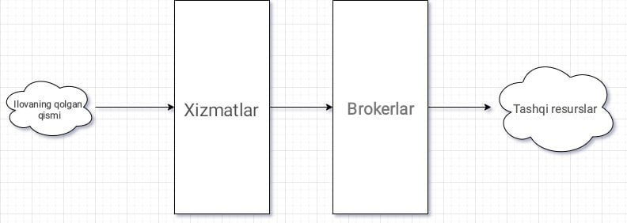

# 2.1 Asos xizmatlar (Broker bilan qo'shni xizmatlar)

## 2.1.0 Kirish

Asos xizmatlar - sizning biznes g'oyangiz va brokerlar o'rtasidagi munosabatni ta'minlovchi ilk qobiqdir.

Umuman olganda, broker bilan qo'shni xizmatlar (asos xizmatlar) biznes g'oyaning gibrid ko'rinishi bo'lib, yuqori darajadagi biznes g'oya bajarilganida abstarakt qatlam vazifasini o'tab beradi. Yuqori darajadagi biznes g'oya haqida keyingi bo'limda batafsil gaplashib o'tamiz. 

Asos xizmatlarning asosiy vazifasi tizimga kiruvchi va undan chiquvchi ma'lumotlarning to'g'riligi va tizim talablariga muvofiqligini tekshirishdan iborat.

Shuningdek, asos xizmatlar, brokerlar taklif qilayotgan asosiy operatsiyalar ustiga qo'shimcha tekshirish qatlamini taqdim etadi.

Misol uchun, agar saqlash brokeri `InsertStudentAsync(Student student)` deb nomlangan metodni takfil qilsa, asos xizmat quyidagi kodni taqdim qiladi:

```csharp
public async ValueTask<Student> AddStudentAsync(Student student)
{
	ValidateStudent(student);

	return await this.storageBroker.InsertStudentAsync(student);
}
```

Bu shuni ko'rsatadiki, asos xizmat broker taklif qilayotgan mavjud operatsiya ustiga qo'shimcha tasdiqlash operatsiyasi qatlamini qo'shishdan boshqa hech qanday ish bajarmaydi.

## 2.1.1 Joylashuv

Asos xizmatlar - brokerlar va ilovangizning qolgan qismi o'rtasida joylashgan bo'lib, uning "chap tomonida" yuqori darajali biznes g'oyani qayta ishlash xizmatlari, orkestratsiya, moslashtirish, yig'ish, boshqarish kabilar yoki oddiy boshqaruvchilar (controllers), UI komponentlar va ma'lumotlarni tashqi dunyoga chiqarib beruvchi boshqa xizmatlar joylashishi mumkin.

<br />
    <p align=center>
        
    </p>
<br />

## 2.1.2 Xususiyatlari

Biz asos yoki broker bilan qo'shni deb atayotgan xizmatlar, umuman olganda, loyihani rivojlantiradigan va integratsiya jarayonini qat'iy boshqaradigan o'ziga xos xususiyatga ega.

Asos xizmatlar - boshqa har qanday ishdan ko'ra, tasdiqlash (validatisya) ishlariga masʼuldirlar. Chunki ularning asl maqsadi, tizimga kiruvchi va undan chiquvchi barcha ma'lumotlarning tizim orqali to'g'ri, hech qanday muammolarsiz ishlashini ta'minlashdir.

Broker bilan qo'shni xizmatlarni boshqaradigan qoidalar va xususiyatlar:

### 2.1.2.0 Sof soddalik

Asos xizmatlar yuqori mantiqli biznes logikaga ega bo'lish uchun bir-qancha oddiy operatsiyalar jamlanmasidan foydalanishni qo'llamaydi.

Masalan, asos xizmatlar, natijalardan foydalangan xolda, ob'yekt mavjudligi va xotirada yangilanishini ta'minlash uchun `Update` yoki `Insert` operatsiyasini `Select` operatsiyasi bilan birlashtirib beruvchi *upsert* funksiyasini taklif qilmaydi.

Bunga qaramay, asos xizmatlar qaramlik chaqiruvlari atrofida tekshirish (validatsiya) va istisnolarni qayta ishlash (va moslashtirish) ishlarini olib boradi. Buni quyidagi misolda ko'rishingiz mumkin:

```csharp
public ValueTask<Student> AddStudentAsync(Student student) =>
TryCatch(async () =>
{
	ValidateStudent(student);

	return await this.storageBroker.InsertStudentAsync(student);
});
```

Yuqoridagi metodda `TryCatch` blokidan avval `ValidateStudent` operatsiyasi chaqirilganini ko'rishingiz mumkin. `TryCatch` blokini men "Shovqinni yo'qotish"ning noodatiy usuli, deb atayman. Bu haqida tez orada gaplashamiz.

Tasdiqlash (validatsiya) funksiyasi kelayotgan ma'lumotlarni brokerga jo'natishdan avval, uning har bir xususiyati tekshirilishini ta'minlaydi. Yuqoridagi kodda `InsertStudentAsync` metodi bunga yaqqol misol bo'ladi. 

### 2.1.2.1 Yagona masʼuliyat tamoyili

Xizmatlar - o‘ziga tegishli broker bilan integratsiya qilinishi va o‘ziga tegishli bo‘lmagan har qanday brokerlar bilan aloqa qilmasligi orqali yagona masʼuliyat tamoyilini qatʼiy taʼminlaydi.

Bu qoida asos xizmatlarning `DateTimeBroker` yoki `LoggingBroker`ni qo'llab-quvvatlashiga taalluqli emas. Chunki bu brokerlar butun tizim bo'yicha deyarli umumiydir.

Asos xizmatlar birdan ortiq har qanday turdagi broker bilan integratsiya qilinmasligi kerak. Chunki bu tekshirish va tartiblash ishlarining murakkablashatiradi. Bu asos xizmatning bosh maqsadi - oddiygina tekshirish qoidasiga mos kelmaydi. Bunday qo'shimcha vazifalarni orkestr nomli xizmatlar bo'limida amalga oshiramiz.

### 2.1.2.2 Biznes g'oya tili

Xizmatlar o'z funksiyalari bilan sodda tilda gaplashadi. Masalan, broker `InsertStudentAsync` nomli metodni taqdim qilsa, xizmat qatlami bu metodning muqobili sifatida `AddStudentAsync` metodidan foydalanadi.

Umuman olganda, CRUD operatsiyalarining aksariyati xotira tilidan biznes logika tiliga o'girilishi kerak. Aslida, bu qoida xotirada saqlanmaydigan Navbat (Queues) kabi operatsiyalar uchun ham amal qiladi. Masalan, biz `PostQueueMessage` deb ataydigan so'rov, biznes logika qatlamida `EnqueueMessage` deyilishi kerak.

CRUD - barcha tizimlarda umumiy operatsiya bo'lganligi sababli, CRUD operatsiyasini quyidagi ko'rinishda moslashtiramiz:

| Brokerlar | Xizmatlar |
| --------- | :-------: |
|  Insert   |    Add    |
|  Select   |  Retrieve |
|  Update   |   Modify  |
|  Delete   |   Remove  |

Keyingi bo'limlarda yuqori darajali biznes logikaga o'tganimizda, metodlarda qo'llaniladigan til texnologik tildan ko'ra biznes tiliga yaqin ekanligini ko'ramiz. 

## 2.1.3 Javobgarlik

Asos xizmatlar har qanday tizimda 3 ta asosiy vazifani bajaradi. Birinchi navbatda, asos xizmatlar, broker operatsiyalarini dasturning qolgan qismi uchun mavhumlashtiradi. Broker - API, tashqi yoki lokal xotiraning qay biri bilan bilan muloqot qilishidan qat'iy nazar, asos xizmatlar, har doim qayta ishlash, orkestratsiya yoki oddiy UI komponentlar kabi yuqori oqim xizmatlari uchun bir xil shartnoma taqdim qiladi. Ikkinchi va eng muhim rol - kiruvchi va chiquvchi ma'lumotlarning tizim tomonidan qayta ishlanishi yoki davom ettirilishini ta'minlash uchun broker allaqachon taklif qilgan mavjud sodda operatsiyalar ustiga tasdiqlash qatlamini taklif qilishdir. Broker bilan ishlashda kerak bo'lgan har qanday operatsiyani bajarishda modellar va shartnomalarni moslashtirish - bu asos xizmatlarning uchinchi vazifasidir.